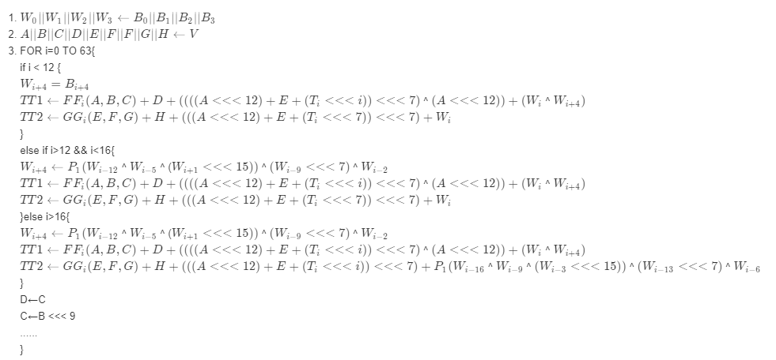

## sm3算法软件优化方法（同济版本优化）
* **对消息扩展字的优化**
    * **优化原因：** 原来的sm3算法对每一分组消息（512比特）采用132次扩展，即使用了132个变量来存储，并进行赋值操作。
    * **优化方法：** 把对消息的扩展操作合并到压缩函数之中，这样会减少许多赋值的操作，同时减少对消息扩展字的存储。
    * **具体步骤：**
        1. 在压缩函数进行64轮迭代之前，生成前4个消息扩展字使用w[0],w[1],w[2],w[3]进行存储。
        2. 在每一轮压缩函数的迭代中，首先进行w[i+4] (i为迭代轮数)的计算。
        3. w'无需存储，在每一轮迭代函数中，计算出了w[i+4],那么w'[i]就可以使用w[i] ^ w[i+4] 计算得出。
* **压缩函数中(Ti <<< (j mod 32))操作的优化**
    * **优化原因：** 在压缩函数64轮的迭代中，(Ti <<< (j mod 32)的操作结果分别对应着一个常量，这些操作在每个消息字的64轮迭代中频繁发生计算。
    * **优化方法：** 可以使用一个长度为64的数组进行存储(Ti <<< (j mod 32)操作，从而使得在每一轮压缩函数的迭代中进行查表操作即可获得结果，省去计算。（此操作相当于使用空间换时间，这部分空间可以视作对消息扩展字优化时省去的w'的空间）
* **对压缩函数中的中间变量进行优化**
    * **优化原因：** 压缩函数的每一轮迭代中，都会使用到SS1，SS2，TT1，TT2这些中间变量，在一轮的迭代中只是使用1到2次
    * **优化方法：** 减少中间变量的使用（SS1，SS2）。
    * **优化步骤：**  
    

* **总体步骤**
压缩函数：

~~~
goos: windows
goarch: amd64
pkg: github.com/kingstenzzz/sm2-improvement/sm3
cpu: Intel(R) Core(TM) i7-10700 CPU @ 2.90GHz
BenchmarkSm3
BenchmarkSm3-16                 18065758                66.40 ns/op           19 B/op          0 allocs/op
>>>同济库SM3
BenchmarkSm3_Tjfoc
BenchmarkSm3_Tjfoc-16           13905240                86.84 ns/op           19 B/op          0 allocs/op

BenchmarkSM3Count
BenchmarkSM3Count/len20
BenchmarkSM3Count/len20-16                      10554516               114.4 ns/op            38 B/op          0 allocs/op
BenchmarkSM3Count/len40
BenchmarkSM3Count/len40-16                       5208697               229.7 ns/op           128 B/op          1 allocs/op
BenchmarkSM3Count/len80
BenchmarkSM3Count/len80-16                       2912168               409.9 ns/op           200 B/op          2 allocs/op
BenchmarkSM3Count/len160
BenchmarkSM3Count/len160-16                      1563560               765.3 ns/op           368 B/op          2 allocs/op
BenchmarkSM3Count/len320
BenchmarkSM3Count/len320-16                       751987              1507 ns/op             672 B/op          2 allocs/op
BenchmarkSM3Count/len640
BenchmarkSM3Count/len640-16                       412875              2907 ns/op            1344 B/op          2 allocs/op
BenchmarkSM3Count/len1280
BenchmarkSM3Count/len1280-16                      207453              5720 ns/op            2688 B/op          2 allocs/op
BenchmarkSM3Count/len2560
BenchmarkSM3Count/len2560-16                      105544             11330 ns/op            5376 B/op          2 allocs/op
BenchmarkSM3Count/len5120
BenchmarkSM3Count/len5120-16                       52996             22564 ns/op           10752 B/op          2 allocs/op
BenchmarkSM3Count/len10240
BenchmarkSM3Count/len10240-16                      26797             44561 ns/op           21120 B/op          2 allocs/op

>>>同济库SM3
BenchmarkSM3_TjfocCount
BenchmarkSM3_TjfocCount/len20
BenchmarkSM3_TjfocCount/len20-16                10505479               114.7 ns/op            38 B/op          0 allocs/op
BenchmarkSM3_TjfocCount/len40
BenchmarkSM3_TjfocCount/len40-16                 5144863               233.2 ns/op           122 B/op          1 allocs/op
BenchmarkSM3_TjfocCount/len80
BenchmarkSM3_TjfocCount/len80-16                 2956294               408.9 ns/op           184 B/op          2 allocs/op
BenchmarkSM3_TjfocCount/len160
BenchmarkSM3_TjfocCount/len160-16                1589409               766.9 ns/op           336 B/op          2 allocs/op
BenchmarkSM3_TjfocCount/len320
BenchmarkSM3_TjfocCount/len320-16                 802132              1496 ns/op             640 B/op          2 allocs/op
BenchmarkSM3_TjfocCount/len640
BenchmarkSM3_TjfocCount/len640-16                 414898              2909 ns/op            1280 B/op          2 allocs/op
BenchmarkSM3_TjfocCount/len1280
BenchmarkSM3_TjfocCount/len1280-16                207450              5709 ns/op            2560 B/op          2 allocs/op
BenchmarkSM3_TjfocCount/len2560
BenchmarkSM3_TjfocCount/len2560-16                105448             11302 ns/op            5376 B/op          2 allocs/op
BenchmarkSM3_TjfocCount/len5120
BenchmarkSM3_TjfocCount/len5120-16                 53104             22453 ns/op           10752 B/op          2 allocs/op
BenchmarkSM3_TjfocCount/len10240
BenchmarkSM3_TjfocCount/len10240-16                26857             44691 ns/op           20480 B/op          2 allocs/op

~~~